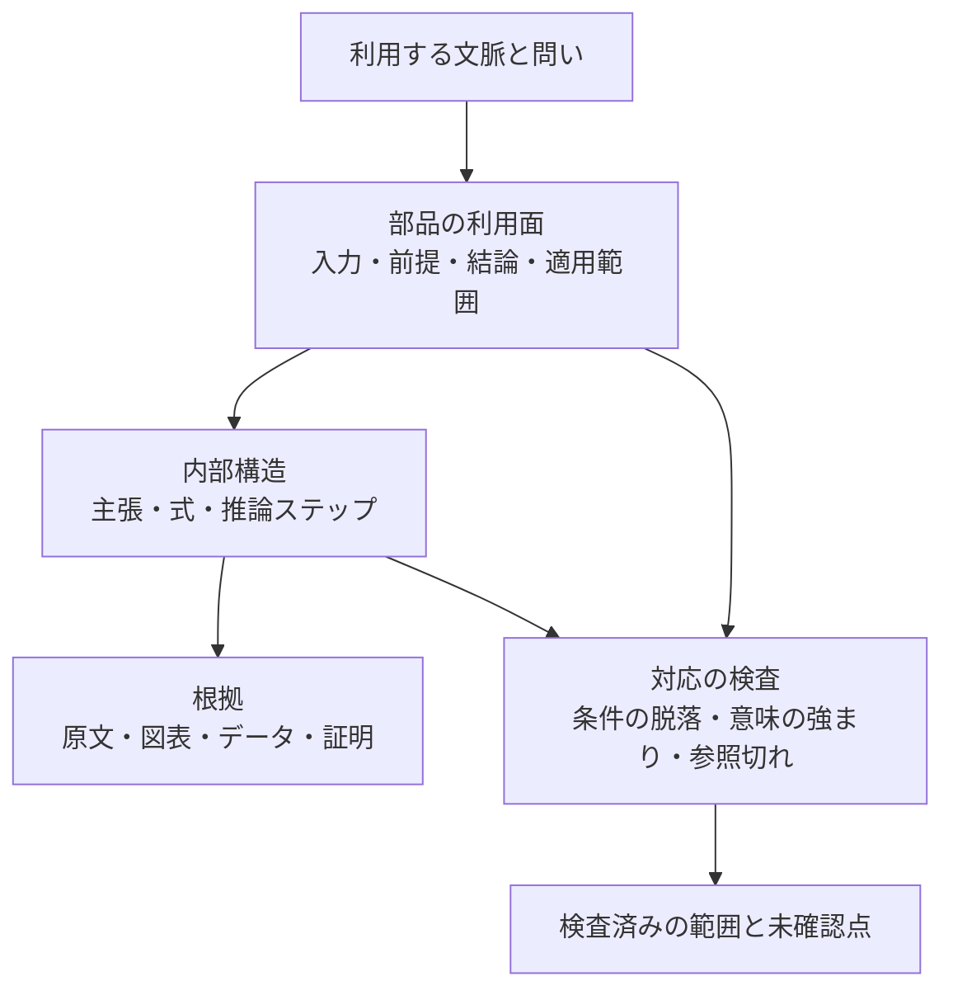

# 知識コンポーネントと抽象化の研究展望

## 1. 結論

知識をコンポーネントに分け、関係構造を明示し、必要なときに内部へ降りられるようにする方向は有望である。とりわけ、**ある知識を利用するときに毎回すべてを理解し直す必要をなくし、それでも前提・導出・根拠を確認できる**という目的には、研究基盤と学習環境の両方に価値がある。

次に強化すべき中心は、コンポーネントの数やグラフの密度ではなく、**抽象化しても維持される意味と、再利用できる条件を明文化すること**である。2026年の理論全体の自動形式化、自然言語に近い知識表現、2025–2026年の因果抽象化研究は、それぞれこの課題の異なる側面を扱っている。もっとも、これらを統合したシステムが研究者の理解や再利用を改善するという直接の実証は、今回確認した文献にはない。個別の成果と、そこから導く設計提案を区別する必要がある。[^1][^2][^3]

推奨する方針は次の五つである。

1. **知識部品の利用契約を検査可能にする。** 入力・出力・前提・適用外条件・根拠・版をセットにする。
2. **概要と詳細の対応を検査する。** 折りたたみによって条件付きの結論が無条件に見えたり、推測が確定事項に見えたりしないようにする。
3. **同一性・同値性・類似性・代替可能性を分ける。** 構造の類似を、知識をそのまま移植できる根拠にしない。
4. **自然言語から段階的に形式化する。** 再利用の多い境界や重要な推論だけを、型・制約・証明へ接続する。
5. **理解を、説明の読みやすさと実際の転用能力の両方で測る。** AIを外した状態での前提判断・誤用検出・再構成も評価する。

この方針を一文にまとめると、**「前提・根拠・適用範囲を保持した知識部品を、目的に応じた粒度で読み、検査し、組み替えられる基盤」**となる。

## 2. 対象範囲と実装上の出発点

### 2.1 評価の範囲

文献の確認基準日は2026年9月15日。2025–2026年の研究を中心に、直接の基礎になる2024年以前の研究と標準を含めた。網羅的な系統的レビューではなく、episteme-graphの設計判断に必要な領域を横断する調査である。最新という表記は確認できた公開文献の範囲を指し、未公開成果や全会議の網羅を意味しない。

実装評価は、HEAD `ae956a7` と、未コミットの変更を含む作業ツリーの静的な確認に基づく。稼働DB、実データの抽出品質、画面操作、テスト実行による動作確認は対象外である。したがって「実装あり」は対応するコードの存在を指す。過去の調査に記載された不具合を、現在も残っているとみなしてはいない。

### 2.2 すでに存在する重要な土台

| 領域 | 現在のコードで確認したこと | 次の改善との関係 |
|---|---|---|
| コンポーネントの境界 | `ComponentRecord` に `inputs`、`outputs`、`preconditions`、`internal_flow`、`assumptions`、`approximations`、`invalid_conditions` がある | 利用契約をゼロから発明する必要はない。既存フィールドを構造化して検査へつなぐ |
| 粒度切り替え | `main`、`equation_detail`、`debug` の層があり、詳細ノードの親、主ノードの構成要素を検査する | 表示上の対応の先に、条件・結論の保存を確認する余地がある |
| 出典と推測の区別 | `source_backed`、`partially_source_backed`、`inferred`、`review_required` を区別し、数式や根拠の参照を検査する | 出典に書かれていることと、数学的・経験的に妥当であることを別軸で扱える |
| 永続化と再解析 | `stable_key` とlive行の同期があり、不一致の旧行をsupersedeし、人間の確定列を保護する | 内容版と意味上の継続性を分ける追加設計の基盤になる |
| 概念の共通化 | 同一性候補、語彙一致、保存済みベクトルによる候補抽出、`mapping_justification`、`exact_match`・`close_match` 等がある | 同一性を自動確定せず、条件付きの対応へ発展させられる |
| 検索と知識構造 | 採用した出典から主張・理論の骨格へ接続する `retrieved_structure` がある | 「RAGは文章しか見ない」という過去の診断は、そのまま現状に適用できない |
| 可搬性 | `knowledge_import` にバンドルと知識オブジェクトの取り込み処理がある | 将来の交換単位に、依存版・利用条件・検査結果を追加できる |

コード根拠は付録Aにまとめた。

### 2.3 最も重要な設計上の差

現状は、**利用契約の材料を保持し、参照や構造を検査する仕組みがある**。確認した範囲では、接続先の前提が接続元の出力から満たされることや、概要が内部の条件付き結論を保存することを、一般的に判定するエンジンまでは確認できない。

例えば「出力式への参照がある」「必要な親ノードがある」「循環がない」は有用な検査だが、それだけでは「この部品をこの条件で使ってよい」とは言えない。今後の焦点は、既存の検査を維持した上で、**参照の正しさから利用条件の整合へ進むこと**にある。

## 3. 関連研究から得られる知見

### 3.1 理論全体の自動形式化：依存関係そのものが知識になる

Minらの **Theory-Level Autoformalization** は、個別の命題を形式化するだけでなく、公理・定義・記法・補題・証明とその依存関係を、まとまった形式ライブラリとして扱うことを提案する。2026年7月公開、8月改訂のposition paperであり、arXivにはICML 2026 Spotlightと記載されている。完成システムの性能実証として読むべき文献ではない。[^1]

episteme-graphへの示唆は、主張だけを部品にしても再利用には不足し、**その主張を述べるための定義環境と、それを支える依存関係も移送単位になる**という点である。また、形式検証を通過した文が元の自然言語の意図に一致しているかは別問題であり、同値性評価が未解決課題として扱われている。

**提案：** 当面は理論全体の自動証明を目指さず、一つの結論について「定義→前提→操作→結論」の閉じた小さな束を作り、再利用時に必要な依存を再現できるようにする。これを複数論文で比較することが、形式化と学習支援の共通の出発点になる。

### 3.2 Rosetta Statements：人が読める構造から始める

Vogtらの **Rosetta Statements** は2026年6月の査読論文である。自然言語の文に近い構造をRDF上で表現し、ORKGに版管理を含む実装を示す。基本的な知識グラフの構築、オントロジー語彙との接続、選択した文型の推論可能化という段階を提案している。[^2]

これは、専門家に最初から論理言語を使わせる必要はないことを示す設計例である。ただし、日本語UIでの使いやすさや、学習成果の改善がこの論文からそのまま保証されるわけではない。

**提案：** `preconditions`などの編集は、最初は「対象」「条件」「操作」「得られる結果」を埋める日本語の文型として提供する。保存時には参照IDと型付きスロットを持たせ、検証器が扱える部分を徐々に増やす。自然言語の表示と機械的な構造が同じレコードに由来するようにする。

### 3.3 因果抽象化：形だけでなく、変更への応答を保存する

SchooltinkとZennaroのCLeaR 2025論文は、異なる粒度の因果モデルについて、グラフ構造に基づく抽象化と、変数・値の写像に基づく抽象化の整合性を結び付けている。重要なのは、詳細を束ねた後も、対応する介入の意味を維持できるかを扱う点である。[^3]

Felekisらの **Distributionally Robust Causal Abstractions** は、環境分布の変化を考慮した抽象化を扱う。2025年10月公開、2026年1月改訂のプレプリントであり、固定された環境だけでうまくいく抽象化から、環境変化に対する頑健性へ課題を広げている。[^4]

**提案：** 抽象化の品質を「要約が自然か」だけでなく、「条件を変えたとき、詳細側と概要側で判断が一致するか」で測る。例えば、近似を外したときに両方の表示で適用不能と分かるかを検査する。

ただし、理論操作グラフは一般に構造的因果モデルではない。`supports`や`derives`を因果的な矢印として解釈してはならない。ここで借りるのは**変更前後で意味が対応することを検査する設計原理**であり、因果抽象化の定理を任意の知識グラフへ適用するものではない。

### 3.4 OMDoc/MMTと小さな理論：分野を越えるには対応写像が必要

MMT/OMDocへのIMPS理論ライブラリの翻訳研究は、2018年の基礎文献である。小さな理論をモジュールとして構成し、理論間の写像を使って知識を移す考え方は、今回の構想に直接関係する。[^5]

**提案：** クロスドメインの探索結果には、「似ている」という判定に加え、対応する対象・演算・前提・結論の一覧を持たせる。名前の違いだけなのか、追加仮定が必要なのか、結論の一部だけが移せるのかを示す。

完全なグラフ同型性は、この目的には厳しすぎる場合も弱すぎる場合もある。粒度の違う二つの説明は同型でなくても同じ結果を表現できるし、同じ形のグラフでも矢印の意味が違えば知識は移せない。探索では類似性を使い、移植時には明示した対応と条件を検査する二段階がよい。

### 3.5 GraphRAGとRAPTOR：多粒度検索は有用だが、意味保存とは別

GraphRAGは、文書から得たグラフのコミュニティ要約を使い、文書集合全体を対象とした質問を扱う。RAPTORは、テキストを再帰的にクラスタ化・要約した階層から検索する。これらは2024年の重要な基礎研究であり、GraphRAGの参照版は2025年改訂である。[^6][^7]

一方、Xiangらの **When to use Graphs in RAG** の2026年2月改訂版では、単純な事実検索と複雑な関係推論で優劣が異なり、文脈量の増加がノイズにもなると報告されている。グラフを作れば常に回答が良くなるわけではない。[^8]

**提案：** 定義や数値を探す質問には直接検索、導出や前提の質問には依存関係の検索、分野全体の比較には集約された構造を使う。既存の`retrieved_structure`を足場に、質問に必要な深さまで拡張する。要約階層は探索用のビューとして扱い、知識部品の利用条件を要約文だけから生成し直さない。

### 3.6 G-reasoner：共通表現で異種の知識を扱う

ICLR 2026の **G-reasoner** は、QuadGraphという四層の共通表現と、グラフ・テキストを扱うモデルを組み合わせる枠組みを示している。異種の知識構造を共通表現で扱おうとする動きとして重要である。[^9]

**提案：** 現時点で専用モデルの学習を優先する必要はない。むしろ、主張・概念・数式・根拠・関係が、同じ参照規則で取り出せる内部表現を整える価値がある。将来の検索方式やモデルを交換するときに、この表現が資産になる。

共通の表現形式は、意味が同じことの証明ではない。四層という数をそのまま採用するより、既存の知識オブジェクトと利用契約を損失なく写せるかを判断基準にする。

### 3.7 SHACLと推論を考慮した検査：構造と論理の境界を明確にする

SHACLはRDFグラフに対する制約検査のW3C勧告である。2026年8月の **Rewrite Once, Validate Anywhere** は、制限されたOWLの断片をSHACL制約に取り込む書き換えを提案する。著者らはISWC 2026論文の技術報告として公開しており、任意の論理体系を扱う一般解ではない。[^10][^11]

**提案：** 既存のPostgreSQLとPython検査を活用し、まず型・参照・必要条件の欠落を検査する。RDFへの全面移行は前提にしない。推論器を追加する場合は、どの論理断片を扱い、どこで「判定不能」になるかを明示する。

制約を満たすこと、前提から結論が導けること、観測が結論を支持することは、それぞれ別の検査である。この区別を保つだけでも「ホワイトボックス」の意味は大きく明確になる。

### 3.8 出典付きの小さな主張と、概念対応の標準

Nanopublicationは、小さな主張に来歴と出版情報を付けるための仕組みである。SSSOMは、概念間の対応について関係の種類や対応の根拠を共有する形式を提供する。これらは新規の万能解ではなく、episteme-graphの既存設計と親和性がある基盤である。[^12][^13]

**提案：** エクスポートする知識部品には、原著者の主張と、抽出者・形式化者・レビュー者の判断を別々に持たせる。「同じ概念と判断した理由」も保存する。標準形式へ写せることと、外部の語彙と意味が一致していることを混同しない。

### 3.9 学習研究：理解のしやすさは転用できることまで確かめる

2025年のBastaniらの高校数学での実験は、AI利用中の成績改善と、AIを外した試験での学習成果を区別する必要を示している。自由度の高い支援では無支援試験の成績低下が報告され、学習向けに設計した支援ではその悪影響がおおむね解消したが、対照群を上回る効果までは確認されなかった。公開本文に加え訂正の存在も確認できるが、訂正文全文の確認ができていないため、本稿では細かな数値比較を採用しない。[^14]

一方、大学の初年次物理を対象とした2025年のRCTは、学習原理に沿って設計したAIチューターによる短期の学習改善を報告する。対象・比較条件・教材が違うため、上記と単純な矛盾ではない。いずれも、大学院レベルの論文理解と長期的な研究能力への効果を直接示したものではない。[^15]

**提案：** 部品を使えることと、その内部を説明できることを別の到達目標にする。常に詳細を読ませる必要はないが、未経験の条件で適用可否を判断できるか、重要な依存を再構成できるかを測る。

## 4. 推奨する知識モデル

以下は文献の実装をそのまま移すものではなく、実装状況と研究を踏まえた設計提案である。

### 4.1 一つの部品に、利用面と内部構造を持たせる

ブラックボックスとして使うときも、最低限次を表示する。

| 項目 | 利用者に答える問い |
|---|---|
| 入力・対象 | 何に対して使えるか |
| 前提条件 | 何が成り立っている必要があるか |
| 出力・保証 | 何が得られ、どの強さで言えるか |
| 適用範囲・適用外条件 | どこで使えなくなるか |
| 根拠と検査状態 | 原文にあるのか、推論なのか、何を確認済みか |
| 版・依存 | どの定義・部品・根拠の版に依存するか |

ホワイトボックスとして開くと、内部の主張・数式・推論ステップ・根拠へ進めるようにする。重要なのは、利用面と内部構造を別々に作文しないことである。同じ参照付きレコードから概要を生成し、情報が省かれた場合には、それを明示する。

ブラックボックス化とは内部の詳細を省略することであり、適用条件や不確実性まで隠すことではない。これをシステムの不変条件にすると、使いやすさと検査可能性を両立しやすい。

### 4.2 利用契約の最小スキーマ

既存フィールドを活かし、追加する部分は小さく保つ。

```text
KnowledgeComponent
  identity: concept_id / component_id
  revision: content_version / source_version
  interface:
    input_refs: 対象・型・単位・スコープ
    assumption_refs: 必要条件の主張ID
    output_refs: 得られる主張・対象
    applicability: 適用範囲・近似・除外条件
  internals:
    member_refs: 主張・式・導出・根拠
    inference_steps: 前提集合 → 結論
  verification:
    checks: 検査種別・対象版・結果・検査器または確認者
    unresolved: 未確認の条件
  provenance:
    source_refs / extraction_run / review_refs
```

`assumptions: list[str]`をすべて直ちに形式論理へ置き換える必要はない。原文の自然言語を保持しつつ、参照する概念、量、関係、作用域を追加する。機械が判断できない条件は、未確認としてそのまま残す。

接続可能性は、単純な関数型のケースなら「出力型が入力型に適合し、必要な前提が利用側の文脈で満たされるか」で検査できる。経験的主張には、対象集団、測定法、時点、推定対象の一致など別の条件が必要になる。全分野を一つの二値判定に押し込まない。

### 4.3 推論を、前提集合を持つ一級の対象にする

例えば「AかつBならC」を、単にA→C、B→Cという二本の辺に分けると、AだけでもCが言えるように見える。次のように、共同で必要な前提をまとめる。

```text
InferenceStep
  premises: [A, B]
  premise_mode: all_required
  rule: 適用した定理・操作・経験的推論
  conclusion: C
  scope: この推論が成立する文脈
  evidence: 根拠参照
```

別の経路DからもCを導けるなら、別の推論ステップとして残す。これによって、ある前提が否定されたときも「C全体が誤り」と即断せず、「一つの支持経路が使えなくなった」と判断できる。

実装はハイパーグラフ専用DBでなくてもよい。推論ステップをノードまたは行にし、前提・結論を参照する構造で表現できる。既存の導出ステップを拡張する方が、別の知識体系を追加するより保守しやすい。

### 4.4 概要と詳細の整合を、問いの範囲を決めて検査する

任意の自然言語説明について完全な意味同値を保証することは難しい。まず、その部品に対して答えられるべき問いを決める。

例えば「何が入力か」「結論は何か」「何を仮定するか」「近似を外すと使えるか」「どの根拠に戻れるか」である。同じ問いに、概要と詳細が矛盾しないことを確認する。



検査は三段階で行う。

1. **機械的な不変条件：** 外部に必要な前提をすべて利用面に公開する。概要の結論には内部の支持経路を持たせる。未確認状態を概要で確定に変えない。
2. **対照例：** 成立する例と、一つの条件を破った不成立例を対にして、両方の粒度で同じ適用判断になるかを見る。
3. **選択的な形式検証：** 数式や論理が扱える領域で、等式・含意・型・次元を検査する。検査済み範囲を超えて保証を広げない。

これは「概要だけで詳細のすべてが復元できる」という要求ではない。利用上重要な問いに対する回答を保存し、必要なときには省略された内部へ戻れることが目的である。

### 4.5 三つの粒度を分ける

**保存する単位、再利用する単位、学ぶ単位は一致しなくてよい。** 一つの式は保存上の単位になっても、学習では複数の式と直観説明を合わせる方がよい。一方、再利用時には、その一部だけが必要になることもある。

現状の`learning_units`とコンポーネントの分離は、この方向に合っている。今後は、論理的な依存を保持したまま、学習者や作業目的に応じたビューを作る。論理グラフと学習順序も分ける。説明の順番を入れ替えることが、前提関係を変更することにならないようにする。

## 5. 「標準化」と「ブレのなさ」の精密化

### 5.1 標準化する対象

標準化の中心は、唯一の説明文や唯一の分類に置くより、次に置く方がよい。

- 主張と前提条件を記述する形式。
- 関係の種類と、その関係から許される推論。
- 出典、確認者、版を記録する方法。
- 抽象と詳細の対応方法。
- 異なる概念体系の対応と、その限界を記録する方法。

これなら、異なる教員の説明、異なる分野の概念化、競合する仮説を併存させられる。「ブレがない」は、すべての人が同じ解釈をすることではなく、**同じ前提・定義・推論規則から何が言え、どこが争点かが安定して追えること**として定義するのがよい。

### 5.2 四種類の対応

| 対応 | 意味 | 扱い |
|---|---|---|
| 同一性 | 同じ概念・対象を指している | スコープと定義を確認して結ぶ |
| 同値性 | 定めた前提の下で相互に導ける | 前提と検査方法を保存する |
| 類似性 | 一部の形・役割・性質が似ている | 発見や比較の候補に使う |
| 代替可能性 | ある用途で差し替えても必要な条件を満たす | 用途、入力条件、許容誤差を指定する |

既存の`exact_match`・`close_match`や人間による確定を維持しつつ、代替可能性は独立の関係として検討する。同じ概念でも、異なる近似を使った方法は差し替えられないことがある。

### 5.3 ID、内容版、意味上の継続を分ける

現在の`stable_key`は文書ID、正規化した本文やラベル、出典ブロック等に由来する。再解析の順序変化に強くする実装だが、本文やブロックが変わればキーも変わり得る。導出ステップではチェーンIDと位置を含む明示的な例外があり、同一チェーン内への挿入に限界が残ることもコードに記されている。

これは直ちにキーの欠陥を意味しない。内容の同定と、意味上の継続性は異なる仕事だからである。将来的には、次を分ける。

1. **概念・部品の持続的ID：** 内容が改訂されても「何についての部品か」を指す。
2. **内容版：** どの定義・条件・根拠の組合せだったかを固定する。
3. **改訂対応：** 同じ部品の改訂、分割、統合、置換を記録する。

承認や検証は対象の内容版に結び付ける。差分が意味に影響しないことを確認できた場合だけ、結果を新しい版へ引き継ぐ。ラベルの変更と前提の追加を、同じ「更新」にしないことが重要である。

### 5.4 検証状態は単一の点数にしない

出典付き、専門家確認済み、形式検証済み、実験で支持、再現済みは、一直線の段階ではない。形式的に正しく導けても、経験的な前提が対象に合わないことがある。反対に、経験的に有用でも形式的な導出が存在しない知識もある。

そのため、検査の種類と対象範囲を並列に表示する。例えば「原文との対応を確認」「単位整合を確認」「導出は未検証」「適用範囲は著者の記述に基づく」のようにする。既存の`source_backed`の意味を拡大せず、別の検査結果を足す設計が適切である。

## 6. 具体例：線形近似を知識部品として扱う

以下は設計を説明するための例であり、実装から抽出した事例ではない。

### 利用面

「基準点の近くで、非線形な関数を一次の式で近似できる」。入力は関数、基準点、変位であり、出力は関数値の一次近似である。ただし、微分可能性や、用途に対して誤差が十分小さいことが必要になる。

### 内部を開く

内部には、基準点、微分またはヤコビアン、剰余項、剰余の評価に使う仮定を表示する。単に「変位が小さい」と書く代わりに、可能なら領域と誤差上限を表す。滑らかさなど、誤差評価に追加で必要な条件も結び付ける。

### 別の場所で使う

別のモデルへ移す際には、入力変数の意味、単位、基準点、対象領域が対応しているかを確認する。同じ「線形化」という操作名だけでは足りない。微分可能性のない点や、誤差が許容できない領域での使用は、適用外または未確認になる。

### 学ぶ

学習者には「なぜ便利か」「どこで破綻するか」「どの誤差を無視したか」を問う。式の展開手順を暗記していなくても利用でき、必要ならその場で内部へ降りられる。さらに、破綻例を判別できれば、ブラックボックスを無批判に受け入れる状態から一歩進める。

この例で共通化されるのは、一次近似という名前だけでなく、**入力・条件・近似結果・誤差評価という利用構造**である。

## 7. 実装の優先順位

| 優先 | 追加するもの | 既存の接続先 | 完了を判断する基準 |
|---|---|---|---|
| 1 | 参照付きの利用契約 | `ComponentRecord`、知識オブジェクト、概念レジストリ | 一つの部品の前提・出力・適用外条件を出典まで追える |
| 2 | 折りたたみ時の条件保存検査 | グラフnormalizer・validator、構造降下 | 重要条件を落とした概要や、推測を強めた概要を検出できる |
| 3 | 推論の前提集合と複数の支持経路 | 導出ステップ、主張・根拠の参照 | 一つの前提変更で、影響する支持経路を説明できる |
| 4 | 目的別の検索範囲 | `retrieved_structure`、component context | 単純検索を悪化させず、前提・導出の質問で必要な構造を取得できる |
| 5 | 版を固定した交換と条件付き対応 | `knowledge_import`、export、同一性リンク | 取り込み先で不足する依存・異なる条件が表示される |
| 6 | 重要な部分の形式検証 | 数式・導出・カートリッジ | 検査対象と非対象を明確にして、実際の誤用を検出できる |

最初の実証範囲としては、一つの理論または手法に絞った少数の文献が適切である。例えば同じ方法を異なる近似条件で使う文献を含め、数十個程度の部品を専門家が点検する。この規模は計画上の提案であり、統計的な十分性を保証する数ではない。

また、学習者向けUIに全項目を一度に追加する必要はない。利用面では短い条件表示と未確認点を見せ、確認操作によって依存関係や原文へ進む。入力の手間を減らすためのLLM提案は有用だが、条件の存在を推測した場合は原文由来と区別する。

## 8. 効果を確かめる評価設計

### 8.1 比較する構成

同じ文献集合、同じモデル、同程度の検索予算で、次を比較する。

1. 文章検索を中心とするRAG。
2. 現行の構造付きシステム。
3. 利用契約と概要・詳細の整合検査を加えたシステム。

第3構成の効果を分解するため、余力があれば「利用契約だけ」「対応検査も追加」を分ける。グラフ方式の違いによる評価に加え、コンテキスト量や抽出精度の差が結果を説明していないかを見る。GraphRAGのベンチマーク研究は、最終回答だけでなく構築・検索・生成の段階を分ける必要性を示している。[^8][^16]

### 8.2 中核となる指標

| 指標 | 測りたいもの | 具体的な測り方 |
|---|---|---|
| 前提の被覆 | 必要条件が保存されているか | 専門家が指定した必須前提のうち、部品と概要に明示された割合 |
| 不正な強まり | 抽象化が結論を過大にしていないか | 条件付き→無条件、関連→因果、候補→確定への変化を数える |
| 接続判断 | 誤った再利用を止められるか | 正しく接続できる対と、条件を一つ破った対を混ぜて評価 |
| 出典への到達 | 説明を原文で確かめられるか | 対象の主張・式に対応する根拠への到達率と時間 |
| 改訂への頑健性 | 無関係な変更に引きずられないか | 段落移動、再抽出、ラベル変更、導出挿入で参照と検査結果を追跡 |
| 影響追跡 | 前提の変更がどこに効くか分かるか | 変更で失われた支持経路と、残る支持経路を正しく区別できるか |
| 転用能力 | 人が別の場面で使えるか | 無支援での適用可否判断、反例検出、新しい問題への適用 |
| 運用負担 | 維持可能か | 部品あたりの専門家レビュー時間、再解析コスト、修正回数 |

閾値は、用途に応じて事前に定める。未知の条件をすべて不成立とするシステムは誤用を減らせても、利用価値を失う。したがって「適用可能」「適用不可」「情報不足」の区別と、各々の誤りを別々に評価する。

### 8.3 学習評価

学習直後の理解確認と、時間を空けた転用課題を分ける。群間で利用時間と教材をできるだけ揃え、既有知識も記録する。自由なAI利用を含む場合は、それ自体の効果と構造表示の効果が混ざらない設計にする。

最も重要な課題は、部品を使ったことのない条件に出会ったときに、必要な前提を確認できるかである。「説明が分かりやすかった」という自己申告も集めるが、それだけで理解向上と結論しない。

### 8.4 研究としての貢献

新しいグラフ構築方式だけでなく、**知識を折りたたんだ際の意味の損失を測る評価セット**に独自性がある。例えば、条件の脱落、前提集合の誤分割、根拠の入れ替わり、類似概念の誤同一視、版の食い違いを埋め込んだ対照例を作る。

既存研究との差分は、「質問に答えられるか」に加えて「知識部品を誤用せず組み合わせられるか」「人が必要な粒度へ往復できるか」を測ることに置ける。ただし、同種の評価が存在しないという新規性の断言には、対象を絞った追加の先行研究調査が必要である。

## 9. この方向で開ける未来

以下は研究結果として確立した予測ではなく、必要条件を伴う将来像である。

### 9.1 近い将来：理解を積み上げられる研究ノート

論文を読むたびに、どの定義・前提・手法を再利用し、どこに新しい貢献があるかが見える。以前に理解した部品は閉じたまま利用し、新しい箇所や違和感のある箇所だけを開ける。説明を何度も生成する負担より、理解の接続を確認する作業に時間を使える。

成立条件は、部品のIDと出典が安定し、異なる論文での条件の違いが失われないことである。単に「この概念は学習済み」と判定するだけでは、違う前提で使われた同じ言葉を見落とす。

### 9.2 中期：知識部品の交換と互換性の確認

研究室や教材間で、「定義・主張・導出・適用条件・根拠・版」を束にして交換できる。取り込む際に、足りない定義や異なる近似が示され、別の方法へ差し替えるときに必要な確認項目が分かる。

ソフトウェアのパッケージ管理に近い面があるが、知識では意味の対応、論争、経験的な妥当性が残る。全自動で互換と判定するより、確認すべき差分が狭く、説明可能になることが現実的な価値である。

### 9.3 中期：主張の変更に追随する知識体系

一つの測定値、前提、定理、レビュー状態が変わったとき、影響を受ける主張や教材をたどれる。通知も「すべてを再確認」ではなく、「この結論の、この支持経路が古くなった」と示せる。

このためには、依存関係の完全性だけでなく、複数の支持経路と版の固定が必要である。参照数が多い部品が必ず重要とは限らない。差し替え可能な根拠があるか、結論にどの程度依存しているかを合わせて見る。

### 9.4 長期：分野横断の仮説形成

異なる分野に共通する操作構造を見つけ、移せる方法と追加で必要な仮定を提案する。「似た論文」の推薦から、「この方法をこちらへ移すには、この条件を検証する必要がある」という提案へ進める。

ここで生まれるものは、最初は新しい知識ではなく、検査可能な仮説である。類似性、対応の候補、検証済みの移植を別の状態として保存すれば、発見を促進しながら、根拠の強さを取り違えずに済む。

### 9.5 長期：人とAIが共有する検査可能な作業対象

AIが説明や仮説を生成し、人が意味と文脈を判断し、検証器が扱える制約を確認する。三者が同じ知識部品と版を参照できれば、会話のたびに前提を再構成する必要が減る。

ただし、外部の知識構造を読めることは、LLM内部の思考過程を可視化したこととは異なる。実現できるホワイトボックス性は、**提示された主張の前提・根拠・操作・検査結果を追えること**である。この範囲を明確にすることで、システムへの信頼も評価可能になる。

## 10. 最終提言

episteme-graphには、コンポーネント、知識オブジェクト、説明の粒度、来歴、概念対応を扱う土台がある。次の一歩として最も効果が見込めるのは、既存の入力・出力・前提条件を用いて、**一つの部品について「いつ使えるか」「内部を開いてもその説明が保たれるか」を実証すること**である。

標準化は、内容を一種類の説明へ統一するより、条件・根拠・対応・版の記述規則を揃えるところから進める。これによって、異なる見方を許しつつ、論理的な関係は追跡可能に保てる。

将来の価値は、知識を小さく分割すること自体より、**理解済みの部分を信頼できる条件の下で再利用し、新しい問題に必要な箇所だけを開いて検査できること**にある。その効果を、誤用の減少、転用能力、レビュー負担の削減として示せれば、この構想は研究支援と教育の両方で明確な位置を持てる。

## 付録A. 実装根拠

以下のリンクは確認時の作業ツリーを指す。ファイルが改訂されると内容や行番号は変わり得る。

- [コンポーネントのスキーマ](../../src/episteme_graph/agents/component_assembly/schema.py)：入力・出力・前提・内部構造・適用外条件。
- [コンポーネント検査](../../src/episteme_graph/agents/component_assembly/validator.py)：型・ID参照・循環・数式のレビュー状態等。
- [グラフのスキーマ](../../src/episteme_graph/agents/component_graph/schema.py)：出典状態とグラフ層。
- [グラフ検査](../../src/episteme_graph/agents/component_graph/validator.py)：概要・詳細の親子参照の検査。
- [安定キー](../../backend/core/knowledge_objects/stable_key.py)：内容由来のキーと導出ステップの例外。
- [live行の同期](../../backend/core/knowledge_objects/sync.py)：UUIDの維持、旧行のsupersede、人間の確定列の保護。
- [同一性候補](../../backend/core/library/identity_candidates.py)：語彙・ベクトルからの候補生成。
- [概念関係の語彙](../../backend/core/library/schema.py)：近い対応と対応根拠の表現。
- [出典から構造への接続](../../backend/api/routes/learning.py)：採用出典と主張・グラフの接続。
- [学習文脈への構造反映](../../backend/core/assistant_context/resolvers/learning.py)：`retrieved_structure`の解決。
- [知識バンドルの取り込み](../../backend/core/knowledge_import/bundle.py)：取り込み単位の定義。
- [既存の構造レビュー](../architecture/knowledge_structure_review_2026-09-12.md)：過去の課題とその後の修正記録。現在の稼働状況の証拠としては使用していない。

## 出典

[^1]: Marcus J. Min et al. **Theory-Level Autoformalization: From Isolated Statements to Unified Formal Knowledge Bases.** 初版2026-07-14、参照版v2は2026-08-05。Position paper、arXivにICML 2026 Spotlightの記載。[論文本文](https://arxiv.org/html/2607.13292v2)。利用箇所：理論全体の形式化、依存関係、自然言語との同値性という限界。

[^2]: Lars Vogt et al. **Rosetta Statements: simplifying FAIR knowledge graph construction with a user-centred approach.** Database, 2026, baag030. 2026-06-02。[査読論文](https://academic.oup.com/database/article/doi/10.1093/database/baag030/8699725)。利用箇所：自然言語に近い表現、ORKG実装、段階的な推論可能化。

[^3]: Willem Schooltink and Fabio Massimo Zennaro. **Aligning Graphical and Functional Causal Abstractions.** CLeaR 2025, PMLR 275:704–730, 2025-05。[会議論文](https://proceedings.mlr.press/v275/schooltink25a.html)。利用箇所：粒度間の構造・機能の整合。一般の知識グラフへの適用は本稿の類推。

[^4]: Yorgos Felekis, Theodoros Damoulas, Paris Giampouras. **Distributionally Robust Causal Abstractions.** 初版2025-10-06、参照版v3は2026-01-21。プレプリント。[論文](https://arxiv.org/abs/2510.04842v3)。利用箇所：環境変化を考慮する抽象化。書誌・概要の確認に基づき、性能数値は利用していない。

[^5]: Jonas Betzendahl and Michael Kohlhase. **Translating the IMPS Theory Library to MMT/OMDoc.** CICM 2018。[著者公開版](https://kwarc.info/people/mkohlhase/papers/cicm18-imps.pdf)。利用箇所：小さな理論、モジュール、理論間の写像。

[^6]: Darren Edge et al. **From Local to Global: A Graph RAG Approach to Query-Focused Summarization.** 初版2024-04-24、参照版v2は2025-02-19。[論文](https://arxiv.org/abs/2404.16130v2)。利用箇所：コミュニティ要約と全体的質問。学習効果・論理的保証の根拠にはしていない。

[^7]: Parth Sarthi et al. **RAPTOR: Recursive Abstractive Processing for Tree-Organized Retrieval.** ICLR 2024、arXiv初版2024-01-31。[論文](https://arxiv.org/abs/2401.18059)。利用箇所：再帰的要約による多粒度検索。

[^8]: Zhishang Xiang et al. **When to use Graphs in RAG: A Comprehensive Analysis for Graph Retrieval-Augmented Generation.** 初版2025-06-06、参照版v3は2026-02-22。[論文本文](https://arxiv.org/html/2506.05690v3)。利用箇所：課題別の効果と検索文脈のトレードオフ。本稿の数値的効果予測には転用していない。

[^9]: Linhao Luo et al. **G-reasoner: Foundation Models for Unified Reasoning over Graph-structured Knowledge.** ICLR 2026。[公式会議ページ](https://proceedings.iclr.cc/paper_files/paper/2026/hash/67e2da8af2476c7441c881fc253042a6-Abstract-Conference.html)。利用箇所：QuadGraphによる共通表現。概要確認に基づく動向紹介。

[^10]: W3C. **Shapes Constraint Language (SHACL).** W3C Recommendation, 2017-07-20。[標準](https://www.w3.org/TR/shacl/)。利用箇所：グラフ制約検査の位置づけ。2026年の草案を勧告済みとして扱っていない。

[^11]: Anouk Oudshoorn, Piotr Gorczyca, Dörthe Arndt. **Rewrite Once, Validate Anywhere: Producing OWL-Aware SHACL Constraints (Extended Version).** 2026-08-14。著者によるISWC 2026論文の技術報告。[本文](https://arxiv.org/html/2608.14104v1)。利用箇所：制限されたOWL断片とSHACL検査の接続。

[^12]: Nanopublications community. **Nanopublications / Guidelines.** 継続更新、2026-09-15確認。[概要](https://nanopub.net/)・[ガイドライン入口](https://nanopub.net/docs/)。利用箇所：小さな主張と来歴・出版情報の独立した扱い。

[^13]: Mapping Commons. **Simple Standard for Sharing Ontology Mappings (SSSOM).** 継続更新、2026-09-15確認。[公式リポジトリ](https://github.com/mapping-commons/sssom/)。利用箇所：対応関係とその根拠の記録。

[^14]: Hamsa Bastani et al. **Generative AI without guardrails can harm learning: Evidence from high school mathematics.** PNAS 122(26), e2422633122, 2025-06-25。[公開本文](https://pmc.ncbi.nlm.nih.gov/articles/PMC12232635/)。訂正：PNAS 122(34), e2518204122, 2025-08-20公開。[訂正書誌](https://pubmed.ncbi.nlm.nih.gov/40833419/)。利用箇所：支援中の成績と無支援時の学習成果の区別。訂正文全文未確認のため細かな効果量は採用していない。

[^15]: Greg Kestin et al. **AI tutoring outperforms in-class active learning: an RCT introducing a novel research-based design in an authentic educational setting.** Scientific Reports 15, 17458, 2025。[論文](https://www.nature.com/articles/s41598-025-97652-6)。出版社の検索可能本文で対象と結論を確認。全文の直接取得には制限があり、詳細な統計比較には使用していない。

[^16]: Yilin Xiao et al. **GraphRAG-Bench: Challenging Domain-Specific Reasoning for Evaluating Graph Retrieval-Augmented Generation.** 初版2025-06-03、参照版v3は2025-06-20。[論文](https://arxiv.org/abs/2506.02404v3)。利用箇所：構築・検索・生成と推論過程を分ける評価。同名のベンチマークを含む文献[^8]とは別の研究。
